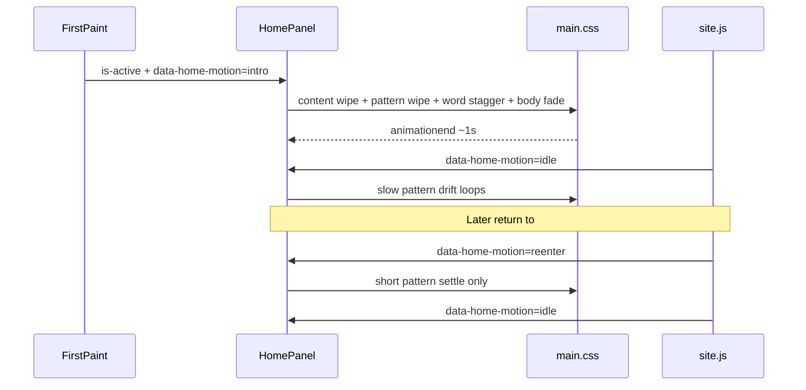

# Home page animations

**Goal:** Make `#home` feel alive and enticing without corporate UI motion — three motions only: split reveal, headline cascade, slow pattern drift.

**Architecture:** CSS owns all keyframes and timings (reuse `--ease`). [`site.js`](tora-tora/assets/js/site.js) only toggles motion state classes when `#home` becomes active. [`front-page.php`](tora-tora/front-page.php) wraps the editable home title into per-word spans so stagger works for any CMS title. No new libraries.

**Tech stack:** Existing theme CSS/JS; static checks in [`tests/run.php`](tests/run.php).

## Locked design

| Motion | Behavior | Duration |
| --- | --- | --- |
| Split seam | `.home-content` slides/fades from left; `.home-pattern` clips/wipes from the seam (transform on `::before`, gutter `::after` stays put) | ~700ms |
| Headline cascade | Title words wrapped in `.home-title-word` + overflow-hidden line masks; staggered `translateY` + opacity | ~60–80ms between words, done by ~900ms |
| Body settle | `.home-content .entry-content` fade-up after title | starts ~500ms |
| Idle drift | `.home-pattern::before` gentle scale 1 → 1.03 (or tiny `background-position` drift), infinite, only while `data-home-motion="idle"` and panel active | 28–36s loop |
| Re-enter | Leaving then returning to `#home`: short pattern scale settle (~350ms), **not** a full intro replay | once per visit |

**Reduced motion:** Existing `@media (prefers-reduced-motion: reduce)` already nukes durations; also skip adding intro/reenter classes when `prefersReducedMotion` is true so content is final-state immediately.

**Out of scope:** Logo/menu-icon chrome motion, cursor parallax, hairline draw, delivery-partner animation, other panels.

## Files to change

- [`tora-tora/front-page.php`](tora-tora/front-page.php) — wrap `$home['title']` words in spans (preserve spaces for wrapping; escape each word).
- [`tora-tora/assets/css/main.css`](tora-tora/assets/css/main.css) — intro/reenter/idle rules, `@keyframes`, final-state defaults; extend reduced-motion block if needed so drifted pattern snaps to rest.
- [`tora-tora/assets/js/site.js`](tora-tora/assets/js/site.js) — in `showPanel`, when `id === "home"`: first paint → `intro`, subsequent activations → `reenter`; on `animationend` / timeout → `idle`; clear motion attrs when leaving home.
- [`tests/run.php`](tests/run.php) — assert presence of home motion hooks (e.g. `home-title-word`, `data-home-motion`, `@keyframes home-pattern-drift`, reduced-motion still present).
- [`docs/superpowers/plans/2026-09-26-home-page-animations.md`](docs/superpowers/plans/2026-09-26-home-page-animations.md) — save this plan beside existing theme plans during implementation.

## Implementation notes

**Title wrapping (PHP):** Split on whitespace; emit `…` so the outer span can `overflow: hidden` and the inner can translate. Keep `h1#home-title` as the accessible name (words concatenate to the same string). Do not force ` ` — Figma wrap stays CSS-driven.

**Pattern seam safety:** Animate transform/opacity of `.home-pattern::before` only. Do not change the white gutter `::after` layout (tests lock that paint-over-speckle behavior). Avoid fill colors behind the pattern that caused blue seam bleed.

**JS state:** Prefer `homeEl.dataset.homeMotion = "intro"|"reenter"|"idle"` on `#home` (or `document.body`). Track `homeHasPlayedIntro` for the session so hash-load straight to `#about` then navigate to home still gets intro once. Clear timeout on rapid panel switches.

**Mobile:** Same motions on the narrow split (`grid-template-columns` at 700px); keep transforms subtle so the thin pattern column does not feel jittery.

## Verification

- Run `php tests/run.php` (or project’s usual test command).
- Manual: cold load `#home` → full intro then drift; navigate away and back → short reenter only; toggle OS “reduce motion” → static final layout, no drift.
- Spot-check that editable home title from Pages still renders correctly with multi-word titles.
## As built (2026-09-26)

Changes from the plan above, made during implementation:

- **Intro state is server-rendered.** `front-page.php` prints `data-home-motion="intro"`, so the entrance starts on first paint instead of flashing the finished layout first. `site.js` only advances it (`intro` → `idle`, `reenter` → `idle`) or clears it when Home is hidden.
- **Reduced motion is gated twice.** All home keyframes sit inside `@media (prefers-reduced-motion: no-preference)`, and `setHomeMotion` sets no state when the visitor prefers reduced motion, so it holds without JS too.
- **Word masks are padded.** `.home-title-word` has `.12em` padding cancelled by an equal negative margin and `vertical-align: top`, so tall glyphs are not clipped at the `.92` line height and every word sits within 1px of where the plain text sat (checked at 1440, 1024, 768, 390, 320 and 568×320).
- **The headline never fades.** Words slide up through their masks; the first starts at 0ms.
- **Pattern wipe uses `clip-path`, with an inset at both ends.** `clip-path` cannot interpolate to `none`, and would jump open halfway through.
- **Phones (≤600px): the body copy rises without fading.** It is the largest element there, and the fade pushed the largest paint (LCP) from about 60ms to 1.25s. Larger screens keep the fade, because the speckle column is their largest paint.
- **Phones have no white gutter,** so the drift and wipe act on the speckle ribbon only.
